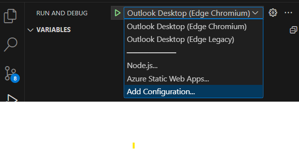

# Outlook add-in with SSO using nested app authentication

## Summary

This sample shows how to use MSAL.js nested app authentication (NAA) in an Outlook Add-in to access Microsoft Graph APIs for the signed in user. The sample displays the signed in user's name and email. It also inserts the names of files from the user's Microsoft OneDrive account into a new message body.

## Features

- Use MSAL.js NAA to get an access token to call Microsoft Graph APIs.
- Fall back to using the Office dialog API for auth when NAA unavailable.

## Applies to

- Outlook on Windows (new and classic), Mac, mobile, and on the web.

## Prerequisites

- Office connected to a Microsoft 365 subscription (including Office on the web).
- [Node.js](https://nodejs.org/) (latest recommended version).
- [npm](https://docs.npmjs.com/downloading-and-installing-node-js-and-npm) version 8 or greater.

## Build and run the solution

### Create an application registration

1. Go to the [Azure portal - App registrations](https://go.microsoft.com/fwlink/?linkid=2083908) page to register your app.
1. Sign in with the **_admin_** credentials to your Microsoft 365 tenancy. For example, **MyName@contoso.onmicrosoft.com**.
1. Select **New registration**. On the **Register an application** page, set the values as follows.

   - Set **Name** to `Outlook-Add-in-SSO-NAA`.
   - Set **Supported account types** to **Accounts in any organizational directory (Any Microsoft Entra ID tenant - Multitenant) and personal Microsoft accounts (e.g. Skype, Xbox)**.
   - In the **Redirect URI** section, ensure that **Single-page application (SPA)** is selected in the drop down and then set the URI to `brk-multihub://localhost:3000`. This allows Office to broker the auth request.
   - Select **Register**.

1. On the **Outlook-Add-in-SSO-NAA** page, copy and save the value for the **Application (client) ID**. You'll use it in the next section.
1. Under **Manage** select **Authentication**.
1. In the **Single-page application** pane, select **Add URI**.
1. Enter the value `https://localhost:3000/auth.html` and select **Save**. This redirect handles the fallback scenario when browser auth is used from add-in.
1. In the **Single-page application** pane, select **Add URI**.
1. Enter the value `https://localhost:3000/dialog.html` and select **Save**. This redirect handles the fallback scenario when the Office dialog API is used.

For more information on how to register your application, see [Register an application with the Microsoft Identity Platform](https://learn.microsoft.com/graph/auth-register-app-v2).

### Configure the sample

1. Clone or download this repository.
1. From the command line, or a terminal window, go to the root folder of this sample at `/samples/auth/Outlook-Add-in-SSO-NAA`.
1. Open the `src/taskpane/msalconfig.ts` file.
1. Replace the placeholder "Enter_the_Application_Id_Here" with the Application ID that you copied.
1. Save the file.

## Choose a manifest type

By default, the sample uses an add-in only manifest. However, you can switch the project between the add-in only manifest and the unified manifest. For more information about the differences between them, see [Office Add-ins manifest](https://learn.microsoft.com/en-us/office/dev/add-ins/develop/add-in-manifests).
If you want to continue with the add-in only manifest, skip ahead to the [Run the sample](#run-the-sample) section.

### To switch to the Unified manifest for Microsoft 365

Copy all files from the **manifest-configurations/unified** subfolder to the sample's root folder, replacing any existing files that have the same names. We recommend that you delete the **manifest.xml** file from the root folder, so only files needed for the unified manifest are present in the root. Then continue with the [Run the sample](#run-the-sample) section.

### To switch back to the Add-in only manifest

If you want to switch back to the add-in only manifest, copy the files in the **manifest-configurations/add-in-only** subfolder to the sample's root folder. We recommend that you delete the **manifest.json** file from the root folder.


## Run the sample

1. Run the following commands.

   `npm install`
   `npm run start`

   This will start the web server and sideload the add-in to Outlook.

1. In Outlook, compose a new email message.
1. On the ribbon for the message, look for the **Show task pane** button and select it.
1. When the task pane opens, there are two buttons: **Get user data** and **Get user files**.
1. To see the signed in user's name and email, select **Get user data**.
1. To insert the first 10 filenames from the signed in user's Microsoft OneDrive, select **Get user files**.

You will be prompted to consent to the scopes the sample needs when you select the buttons.

## Debugging steps

You can debug the sample by opening the project in VS Code.

1. Select the **Run and Debug** icon in the **Activity Bar** on the side of VS Code. You can also use the keyboard shortcut <kbd>Ctrl</kbd>+<kbd>Shift</kbd>+<kbd>D</kbd>.
1. Select the launch configuration you want from the **Configuration dropdown** in the **Run and Debug** view. For example, **Outlook Desktop (Edge Chromium)**.
1. Start your debug session with **F5**, or **Run** > **Start Debugging**.



For more information on debugging with VS Code, see [Debugging](https://code.visualstudio.com/Docs/editor/debugging). For more information on debugging Office Add-ins in VS Code, see [Debug Office Add-ins on Windows using Visual Studio Code and Microsoft Edge WebView2 (Chromium-based)](https://learn.microsoft.com/office/dev/add-ins/testing/debug-desktop-using-edge-chromium)

## Key parts of this sample

The `src/taskpane/authConfig.ts` file contains the MSAL code for configuring and using NAA. It contains a class named AccountManager which manages getting user account and token information.

- The `initialize` function is called from Office.onReady to configure and initialize MSAL to use NAA.
- The `ssoGetAccessToken` function gets an access token for the signed in user to call Microsoft Graph APIs.
- The `getTokenWithDialogApi` function uses the Office dialog API to support a fallback option if NAA fails.

The `src/taskpane/taskpane.ts` file contains code that runs when the user chooses buttons in the task pane. It uses the AccountManager class to get tokens or user information depending on which button is chosen.

The `src/taskpane/msgraph-helper.ts` file contains code to construct and make a REST call to the Microsoft Graph API.

### Fallback code

The `fallback` folder contains files to fall back to an alternate authentication method if NAA is unavailable and fails. When your code calls `acquireTokenSilent`, and NAA is unavailable, an error is thrown. The next step is the code calls `acquireTokenPopup`. MSAL then attempts to sign in the user by opening a dialog box with `window.open` and `about:blank`. Some older Outlook clients don't support the `about:blank` dialog box and cause the `aquireTokenPopup` method to fail. You can catch this error and fall back to using the Office dialog API to open the auth dialog instead.

- the `src/taskpane/authconfig.ts` file contains the following code to detect the error and fall back to using the Office dialog API.

```typescript
    // Optional fallback if about:blank popup should not be shown
    if (popupError instanceof BrowserAuthError && popupError.errorCode === "popup_window_error") {
        const accessToken = await this.getTokenWithDialogApi();
        return accessToken;
```

- The `src/taskpane/fallback/fallbackauthdialog.ts` file contains code to initialize MSAL and acquire an access token. It sends the access token back to the task pane.

## Security reporting

If you find a security issue with our libraries or services, report the issue to [secure@microsoft.com](mailto:secure@microsoft.com) with as much detail as you can provide. Your submission may be eligible for a bounty through the [Microsoft Bounty](https://aka.ms/bugbounty) program. Don't post security issues to [GitHub Issues](https://github.com/AzureAD/microsoft-authentication-library-for-android/issues) or any other public site. We'll contact you shortly after receiving your issue report. We encourage you to get new security incident notifications by visiting [Microsoft technical security notifications](https://technet.microsoft.com/security/dd252948) to subscribe to Security Advisory Alerts.

## More resources

- NAA docs to get started: https://aka.ms/NAAdocs
- NAA FAQ: https://aka.ms/NAAFAQ
- NAA Word, Excel, and PowerPoint sample: https://aka.ms/NAAsampleOffice

## Extension plan: NAA + OBO token exchange

This section documents the planned extension to prove end-to-end token exchange from the Outlook add-in to a second Entra app registration via a middle-tier server.

### Target architecture

```
[Outlook Add-in (taskpane)]
    |
    | 1. NAA → acquireTokenSilent/Popup
    |    scopes: ["api://<Reg-A-client-id>/access_as_user"]
    v
[Hono middle-tier server  — server/]          ← App A
    |
    | 2. Validate Bearer token (issuer, audience, scope)
    | 3. OBO exchange → acquireTokenOnBehalfOf
    |    scopes: ["api://<Reg-B-client-id>/access_as_user"]
    v
[App B — web portal + /api/chat agent]         ← App B
    |
    | 4. Receive token (aud = App B), validate it
    | 5. OBO exchange → acquireTokenOnBehalfOf
    |    scopes: ["https://graph.microsoft.com/.default"]
    v
[Microsoft Graph — /me/mail, /me/calendar, etc.]
```

The user's delegated identity flows through the full chain. App B's agent calls Graph **on behalf of the signed-in Outlook user** — no separate sign-in required.

### Stack

| Layer | Technology |
|---|---|
| Add-in frontend (App A) | React + `@azure/msal-browser` (NAA) |
| Middle-tier (App A) | Hono on Node.js (`server/`) |
| App B frontend | React (web portal) |
| App B backend | Hono + `@hono/node-server` (`app-b/server/`) |
| Auth library (servers) | `@azure/msal-node` |
| Token validation | `jsonwebtoken` + `jwks-rsa` |
| Agent / AI | Vercel AI SDK or similar, calling Graph |
| Downstream API | Microsoft Graph |

### Folder structure

```
Outlook-Add-in-SSO-NAA/              ← App A
  src/                              ← add-in frontend (React, NAA)
  server/
    src/
      index.ts                      ← Hono app + @hono/node-server, CORS
      middleware/
        validateToken.ts            ← JWT verify: signature, issuer, audience, scp
      auth/
        oboHelper.ts                ← ConfidentialClientApplication + acquireTokenOnBehalfOf (→ App B)
      routes/
        api.ts                      ← GET /api/whoami → returns OBO token claims as JSON
    .env                            ← CLIENT_ID, CLIENT_SECRET, TENANT_ID, TARGET_CLIENT_ID
    package.json
    tsconfig.json
  package.json                      ← adds "start:server" script

app-b/                               ← App B (web portal + agent)
  frontend/
    src/                            ← React web portal UI
  server/
    src/
      index.ts                      ← Hono app, CORS
      middleware/
        validateToken.ts            ← validates token with aud = App B client ID
      auth/
        oboHelper.ts                ← OBO exchange assertion=App-B-token → Graph token
      routes/
        chat.ts                     ← POST /api/chat → agent loop → Graph calls
    .env                            ← APP_B_CLIENT_ID, APP_B_CLIENT_SECRET, TENANT_ID
    package.json
    tsconfig.json
```

### Phase 1 — Azure Portal (verified working)

#### Reg A (add-in / middle-tier registration)

1. **SPA redirect URIs** (Authentication blade):
   - `brk-multihub://localhost:3000` ← required for NAA broker trust
   - `https://localhost:3000/auth.html`
   - `https://localhost:3000/dialog.html`

2. **Expose an API**:
   - Set Application ID URI to `api://<client-id>` (e.g. `api://00e7ef2d-...`)
   - Add scope: `access_as_user` (Admins and users, Enabled)
   - Note the scope's GUID (e.g. `b0a40dc2-...`) — needed for pre-authorization

3. **Pre-authorize the app itself** (critical for NAA silent token acquisition):
   - In **Expose an API → Authorized client applications**, add the app's **own client ID** (`00e7ef2d-...`) with the `access_as_user` scope ticked
   - Do **not** add Office broker app IDs here — the `brk-multihub` redirect URI already handles broker trust
   - Without this self-pre-authorization the NAA broker returns `ff000000` correlation ID (local rejection) with error code `3399614466`

4. **Manifest** (edit via portal Manifest blade):
   - Set `"requestedAccessTokenVersion": 2` in the `api` object — required for v2 tokens compatible with OBO

5. **API permissions** on Reg A:
   - Add `api://<Reg-B-client-id>/<scope>` → grant admin consent
   - Add `User.Read` from Microsoft Graph (for existing NAA demo flows)

6. **Client secret**: Add one under Certificates & secrets → save to `server/.env`

#### Reg B (App B registration — web portal + agent)

1. Single-tenant
2. **Redirect URIs**: add `http://localhost:4000` (App B frontend) as SPA platform if it also does interactive sign-in; otherwise none needed since tokens arrive via OBO
3. **Expose an API**: Application ID URI `api://<app-b-client-id>`, add scope `access_as_user`
4. **Manifest**: set `"accessTokenAcceptedVersion": 2`
5. **API permissions** on Reg B — add delegated Graph permissions App B's agent needs, e.g.:
   - `Mail.Read`
   - `Calendars.Read`
   - `User.Read`
   → Grant admin consent for all
6. **Client secret**: add one → save to `app-b/server/.env`

#### Verifying NAA token acquisition before building the server

Use the **Show Reg A token (OBO)** debug button in the task pane (added in `taskpane.ts`). It calls:
```ts
accountManager.ssoGetAccessToken(["api://<client-id>/access_as_user"])
```
Paste the resulting token into [jwt.ms](https://jwt.ms) and confirm `aud = api://<client-id>`.

Then test OBO exchange directly with `curl.exe` (no server needed):
```powershell
$assertion = "<token-from-taskpane>"
curl.exe -s -X POST `
  "https://login.microsoftonline.com/<tenant-id>/oauth2/v2.0/token" `
  --data-urlencode "grant_type=urn:ietf:params:oauth:grant-type:jwt-bearer" `
  --data-urlencode "client_id=<Reg-A-client-id>" `
  --data-urlencode "client_secret=<Reg-A-client-secret>" `
  --data-urlencode "assertion=$assertion" `
  --data-urlencode "scope=api://<Reg-B-client-id>/access_as_user" `
  --data-urlencode "requested_token_use=on_behalf_of"
```
> **Important**: the grant type URN is `urn:ietf:params:oauth:grant-type:jwt-bearer` (no `2` after `oauth`).
> Using `Invoke-RestMethod` with a hashtable body can silently URL-encode the colons in the grant type,
> causing `AADSTS70003: unsupported_grant_type`. Use `curl.exe --data-urlencode` to avoid this.

Paste the returned `access_token` into [jwt.ms](https://jwt.ms) and confirm `aud = api://<Reg-B-client-id>`. This proves the full OBO chain works before writing any server code.

### Phase 2 — App A: Hono middle-tier server

**`validateToken.ts`** — extracts `Authorization: Bearer <token>`, verifies signature via AAD JWKS endpoint, validates `issuer`, `audience` (Reg A client ID), and `scp` contains `access_as_user`. Returns 401 on failure.

**`oboHelper.ts`** — singleton `ConfidentialClientApplication` using Reg A credentials. Exports `exchangeToken(assertion)` which calls `acquireTokenOnBehalfOf` with `scopes: ["api://<Reg-B-client-id>/access_as_user"]`.

**`GET /api/whoami`** — validates token → OBO exchange → decodes OBO token → returns claims:
```json
{
  "oid": "...",
  "name": "...",
  "upn": "...",
  "aud": "api://<Reg-B-client-id>",
  "scp": "access_as_user"
}
```
The `aud` field proves App A successfully obtained a token scoped to App B.

### Phase 3 — App A: React frontend (Outlook taskpane)

- Replace `taskpane.ts` + HTML with a React root
- Reuse existing `AccountManager` class (NAA logic unchanged)
- Add a **Launch Agent** button: `ssoGetAccessToken(["api://<client-id>/access_as_user"])` → POST to `https://localhost:3001/api/proxy-chat` (App A forwards to App B with OBO token) → stream response back to taskpane

### Phase 4 — App A: Dev wiring

- `server/.env`: `CLIENT_ID`, `CLIENT_SECRET`, `TENANT_ID`, `TARGET_CLIENT_ID`
- Root `package.json`: `"start:server": "cd server && npm run dev"`
- CORS on Hono: allow `https://localhost:3000`
- End-to-end test: NAA token → `validateToken` passes → OBO exchange → App B token with `aud = api://<Reg-B-client-id>`

### Phase 5 — App B: Web portal + agent backend

App B is a standalone web application (separate repo/folder) with its own Entra registration. It receives the OBO token from App A (or directly from a browser client) and uses a **second OBO exchange** to obtain a Graph token, which the agent uses to call Microsoft Graph on behalf of the user.

#### App B backend (`app-b/server/`)

**`validateToken.ts`** — validates incoming token with:
- `aud = api://<app-b-client-id>`
- `iss = https://login.microsoftonline.com/<tenant-id>/v2.0`
- `scp` contains `access_as_user`

**`oboHelper.ts`** — uses App B's own `CLIENT_ID` + `CLIENT_SECRET` to do a second OBO:
```typescript
const result = await cca.acquireTokenOnBehalfOf({
  oboAssertion: appBToken,           // token received from App A (aud = App B)
  scopes: ["https://graph.microsoft.com/.default"],
});
// result.accessToken is now a Graph token for the user
```

**`POST /api/chat`** — the agent endpoint:
1. Validate incoming token (must have `aud = App B`)
2. OBO → get Graph token
3. Run agent loop (e.g. Vercel AI SDK) with Graph tool calls:
   - `GET https://graph.microsoft.com/v1.0/me` — user identity
   - `GET https://graph.microsoft.com/v1.0/me/messages` — emails
   - `GET https://graph.microsoft.com/v1.0/me/events` — calendar
4. Stream response back to caller

#### App B frontend (`app-b/frontend/`)

- React SPA, MSAL.js for direct browser sign-in (optional — can also receive token forwarded from App A)
- Chat UI that streams responses from `/api/chat`
- When embedded via iframe or called from Outlook add-in taskpane, receives token from App A rather than doing its own interactive sign-in

#### Key constraint: consent must cover the full chain

For the chained OBO to work silently, the user must have consented (or an admin must have granted consent) for **all** permissions in the chain at first sign-in:
- App A scope: `access_as_user` on Reg A
- App B scope: `access_as_user` on Reg B (granted via App A's API permissions)
- Graph permissions: `Mail.Read`, `Calendars.Read`, `User.Read` (granted via App B's API permissions)

If any consent is missing, Entra returns `interaction_required` on the OBO call. The middle tier should propagate this as a `claims` challenge back to the client.

---

## Questions and feedback

- Did you experience any problems with the sample? [Create an issue](https://github.com/OfficeDev/Office-Add-in-samples/issues/new/choose) and we'll help you out.
- We'd love to get your feedback about this sample. Go to our [Office samples survey](https://aka.ms/OfficeSamplesSurvey) to give feedback and suggest improvements.
- For general questions about developing Office Add-ins, go to [Microsoft Q&A](https://learn.microsoft.com/answers/topics/office-js-dev.html) using the office-js-dev tag.

## Copyright

Copyright (c) 2024 Microsoft Corporation. All rights reserved.

This project has adopted the [Microsoft Open Source Code of Conduct](https://opensource.microsoft.com/codeofconduct/). For more information, see the [Code of Conduct FAQ](https://opensource.microsoft.com/codeofconduct/faq/) or contact [opencode@microsoft.com](mailto:opencode@microsoft.com) with any additional questions or comments.


